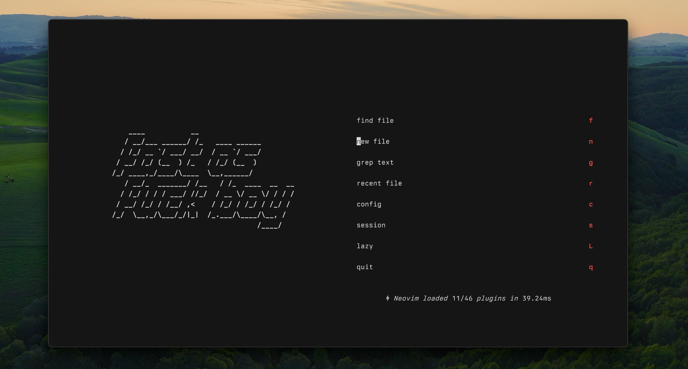

# Dotfiles



## What's inside?

- Custom terminal stuff (aliases, prompts, etc.)
- Nvim config for when I need to get things done fast
- Settings to keep things smooth

## How to use

1. Clone this repo:

   ```bash
   git clone https://github.com/assafdori/dotfiles.git ~/dotfiles
   ```

2. Run the install script:

   ```bash
   cd ~/dotfiles && ./init.sh
   ```

3. Done
