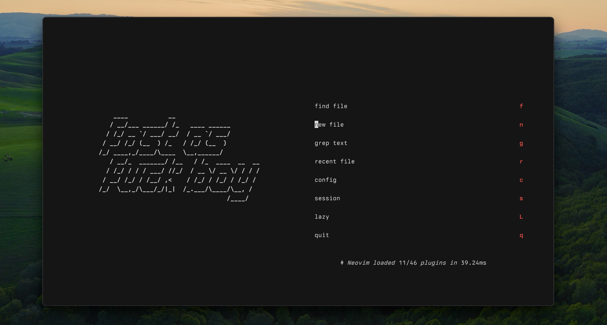

# Dotfiles



> setup is opinionated as hell. modify before use or suffer the consequences.

## what's inside

- Terminal setup that doesn't embarrass me
- Neovim config because I like HJKL
- General sanity settings

## Quick Start

Fresh Mac? One liner and you're home:

```bash

curl -fsSL https://raw.githubusercontent.com/assafdori/dotfiles/main/scripts/bootstrap.sh | bash

```

Does the boring stuff so you don't have to:

1. Xcode CLI tools, Homebrew, Git
2. SSH keys from iCloud
3. Clones this repo and runs the full setup
